# Harsh Tiwari

**Software engineer in Gurugram** — I build web and mobile products
and I'm increasingly obsessed with how systems behave once they get busy.

Currently building at **India Shelter Finance Corporation**

 

<picture>
  <source media="(prefers-color-scheme: dark)" srcset="assets/contributions-dark.svg" />
  <source media="(prefers-color-scheme: light)" srcset="assets/contributions-light.svg" />
  
</picture>

## What I'm on right now

- 🛠️ Building **JobTrackr** — a Chrome extension plus web app that captures job postings and tracks applications, referrals and interviews in one dashboard
- 📚 Working through **Python** and **low-level design**, mostly to stop guessing and start reasoning
- 🤝 Keen to collaborate on **MCP** and **RAG** projects
- 🌙 Night shift is on. Always. No, I will not be taking questions

## Stack

**Languages**

**Building with**

**Data and infra**

## A few things I've built

| Project | What it is |
| --- | --- |
| [**JobTrackr**](https://github.com/imhrsit/JobTrackr) | Chrome extension and web app that turns a job posting into a tracked application in one click |
| [**CRM-System**](https://github.com/imhrsit/CRM-System) | Full-stack CRM with AI-assisted lead scoring and automatic assignment |
| [**Live-Polling-System**](https://github.com/imhrsit/Live-Polling-System) | Real-time polling over Socket.io — create a poll, watch results land instantly |
| [**Branch-chat-system-application**](https://github.com/imhrsit/Branch-chat-system-application) | Customer messaging platform with live updates and an agent dashboard |

## Pac-Man is eating my commits

<picture>
  <source media="(prefers-color-scheme: dark)" srcset="https://raw.githubusercontent.com/imhrsit/imhrsit/output/pacman-contribution-graph-dark.svg" />
  <source media="(prefers-color-scheme: light)" srcset="https://raw.githubusercontent.com/imhrsit/imhrsit/output/pacman-contribution-graph.svg" />
  
</picture>

---

The calendar above is rendered from live data by <a href="scripts/contrib-3d.mjs">a script in this repo</a> and refreshed daily.

 

💡 <i>"Weeks of coding can save you hours of planning."</i>

